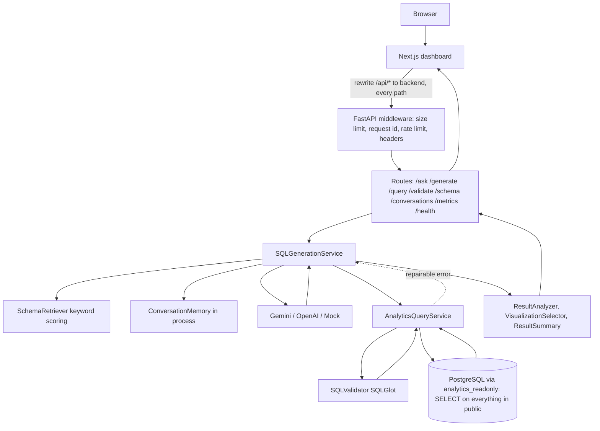
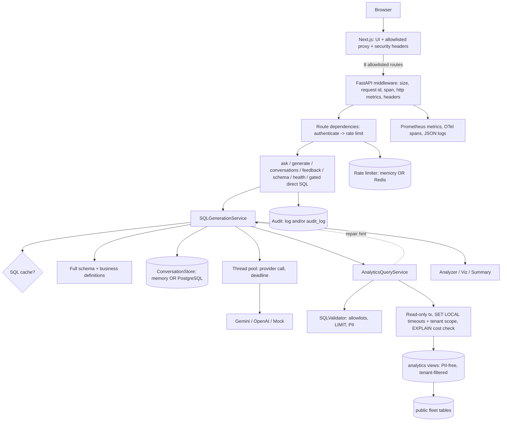

# Sequence: How this project works, how it grew, and what could be simpler

| | |
|---|---|
| **Baseline analysed (labelled V1)** | `98ccd2cdbcfcd5cf598b6402596526c83b792c15` ("docs(release): finalize project documentation and portfolio readiness", 2026-10-02) |
| **Current analysed (HEAD)** | `440e7b9502269fd2c714445439cc527e03355810` (2026-10-06) |
| **Relationship** | The baseline **is an ancestor** of HEAD. There is one merge commit after it (see section 7). |
| **Method** | Read-only Git (`log`, `show`, `diff`, `ls-tree`, `grep`) and reading source. No code was changed, no tests or builds were run, nothing was installed. |
| **Status of the working tree** | Clean when analysis began. Only this file was added. |

> **Update:** this analysis was written at `440e7b9`, before anything after the baseline had been run. A stabilization pass has since executed the code and fixed seven defects; its results are in `progress.md` section 22. Statements below that code "has never been executed" describe the state at `440e7b9`.

**Read this first about evidence.** Nothing after the baseline has ever been executed: no test run, linter, build, migration, or app start has happened since commit `abd5ac3`. Statements below about *what code does* come from reading it. Statements about *whether it works* are marked unverified. The baseline's own claims ("all tests pass") come from `progress.md` and are also not re-verified here.

**Authorship note, stated plainly.** The two large post-baseline changes (`abd5ac3`, `e869768`/`23e1de5`) were produced by an AI coding agent in direct response to a plan (`sprints.md`) that was itself derived from an audit. They are not accidents: each addition traces to a numbered requirement. That is exactly why this document judges them on cost versus benefit rather than on whether they were "asked for".

---

## 1. Executive summary

**What the project is.** A natural-language analytics tool for a fleet-management SaaS dataset. A user types a question ("top 10 customers by revenue"); the backend asks an LLM (Gemini, or a deterministic mock) for SQL, checks that SQL with an AST validator, runs it read-only against PostgreSQL, and returns rows plus a KPI, a chart choice, and a summary. A Next.js dashboard renders it.

**What changed.** In four days (2026-10-02 to 2026-10-06) the repository went from **123 tracked files / ~14k lines** to **219 files / ~30k lines** (`+16,100 / -847` lines across 163 files). Nothing was deleted or renamed; the change is almost entirely additive.

| Measure | Baseline | HEAD |
|---|---|---|
| Tracked files (excluding lockfile and images) | 123 | 219 |
| Backend runtime code (`backend/app`) lines | ~3,000 | ~6,000 |
| Backend test functions | 69 | 316 |
| Frontend test cases | 11 | 90 |
| API route registrations (`backend/app`) | 15 | 20 |
| `.env.example` settings | 27 | 55 |
| Docker Compose services | 3 | 7 (+3 override files) |
| Docs files in `docs/` | 9 | 21 |
| CI workflow files | 1 | 4 (+ dependabot config) |
| Backend runtime dependencies | 10 | 13 (`pyjwt`, `prometheus-client`, `redis`) |
| Frontend runtime dependencies | 5 | 5 (unchanged) |
| Alembic migrations | 1 | 3 |

**Why it feels bigger than it is.** Roughly **60 % of the added lines are tests, CI, docs, dashboards, runbooks, and evaluation tooling**, not runtime behaviour. The runtime core roughly doubled; everything *around* it grew about tenfold.

**The honest verdict.** The post-baseline work falls into three kinds:

1. **Security hardening that changes what the product can safely do** (auth, tenant-scoped database views, personal-data removal, function allowlist, read-only transactions, `LIMIT` enforcement). This is essential if real customer data is ever involved. It is also where the baseline was weakest.
2. **Correctness fixes** (error classification by SQLSTATE, repair hints, KPI detection, formatting, follow-up context). Real bugs, small code.
3. **Operational scaffolding for scale and teams** (Redis limiter, PostgreSQL conversation store, SQL cache, OpenTelemetry, Prometheus, audit trail, 5 runbooks, k6, Playwright, release pipeline, evaluation suite, Kubernetes manifests). All of it is **optional or off by default**, none of it was needed to run the baseline, and most of it only pays off with multiple replicas, an on-call rotation, or a compliance requirement. This is where the complexity came from.

The decision you actually face is about group 3: **which deployment story is this project?** A portfolio / single-instance tool, or a multi-replica service with operators. The roadmap in section 15 splits along that line.

---

## 2. Project purpose and scope

**Problem.** Fleet operators and analysts want answers from operational and billing data without writing SQL, and without handing an LLM a way to damage or leak the database.

**Users.** Fleet operators, business analysts, revenue teams (`README.md`, `progress.md`).

**Core functionality (demonstrated by code, at baseline and now):**

- `POST /api/v1/analytics/ask`: question in, validated and executed SQL plus result analysis out.
- Schema-aware prompt construction from the SQLAlchemy models.
- SQL safety: SQLGlot AST validation, a table/column allowlist, a separate read-only database role, statement timeout, row cap.
- A bounded repair loop for SQL that fails validation or execution.
- Result intelligence: KPI detection, chart-type selection, deterministic summary.
- Multi-turn conversation context.
- A single-page dashboard.

**Dataset.** Eleven fleet tables (customers, users, vehicles, drivers, trips, vehicle_locations, fuel_records, maintenance_records, invoices, payments, subscriptions) seeded deterministically (`backend/app/db/seed.py`: 100 customers, 1,000 vehicles, 50,000 trips, ...).

**Out of scope even now:** writes of any kind, non-PostgreSQL sources, an identity provider, billing, multi-region.

---

## 3. Technology stack and why

| Layer | Technology | Why it is used | Added after baseline? |
|---|---|---|---|
| API | FastAPI, Pydantic, pydantic-settings | typed request/response models, dependency injection, settings from environment | no |
| Database access | SQLAlchemy 2, psycopg 3, Alembic | models double as the schema description for prompts; migrations | no |
| SQL safety | **SQLGlot** (PostgreSQL dialect) | parse model output into an AST so rules are structural, not regex | no |
| LLM | `google-genai` (Gemini), `openai` (legacy), deterministic mock | Gemini is the real path; mock makes tests and demos free | no |
| Frontend | Next.js 16, React 19, TypeScript, Tailwind, Recharts, lucide-react | dashboard and charts; a server-side rewrite proxy keeps calls same-origin | no (deps unchanged) |
| Tests | pytest, httpx, Vitest, Testing Library | | `pytest-cov`, `mypy`, `pip-audit` added (dev) |
| Infra | Docker, Docker Compose, GitHub Actions | local stack and CI | extended heavily |
| **Auth** | `pyjwt` | verify signed bearer tokens | **yes (V2)** |
| **Metrics** | `prometheus-client` | Prometheus text exposition and histograms | **yes (V3)** |
| **Shared rate limit** | `redis` | cross-replica limiter | **yes (V3)** |
| Tracing | `opentelemetry-*` | optional extra, imported lazily | **yes (V3, optional extra)** |
| E2E / load | Playwright + axe (own `e2e/package.json`), k6 | browser tests, capacity test | **yes (V3, separate packages)** |

---

## 4. Repository structure (current)

```
backend/
  app/
    main.py                  FastAPI app, middleware, exception handlers, router wiring
    api/                     HTTP layer: analytics (gated direct SQL), generation (/generate,/ask),
                             conversations, schema, feedback, health
    analytics/               validator.py (SQLGlot), service.py (executor), serialization, dependencies
    services/                generation.py (orchestrator), schema_retriever, result_analyzer,
                             visualization, result_summary, result_models, business_definitions,
                             sql_cache (V3), llm_dependencies
    llm/                     provider protocol, gemini/openai/mock providers, prompt builder, parser
    conversation/            service.py (store interface + in-memory), sql_store.py (V3)
    core/                    config, logging, middleware, telemetry, deadline (V2), auth (V2),
                             rate_limit (V2), redis_limiter (V3), metrics, tracing (V3),
                             audit (V3), ops_auth (V3)
    db/                      models access: session, analytics engine, schema_metadata, seed,
                             analytics_surface (V2), operational (V3)
    models/entities.py       the 11 fleet tables + seed_runs
    jobs/purge.py            retention job (V3)
    schemas/                 Pydantic request/response models
    sql/examples.py          UNUSED (see 12)
  alembic/versions/          3 migrations (initial, analytics views V2, operational tables V3)
  evals/                     text-to-SQL evaluation runner, scoring, 76 golden cases (V3)
  scripts/                   check_coverage.py, issue_token.py (V2/V3)
  tests/                     29 files
frontend/
  app/                       layout + page (renders the dashboard)
  components/analytics/      dashboard, composer, results, error-panels (V2), examples-panel (V3)
  components/charts/         chart-renderer, error boundary
  components/layout/         sidebar
  lib/                       api, mock-data (tests only), utils; auth, chart-utils (V2); csv,
                             conversation-store, schema (V3)
  contracts/                 api-contract.json (V3)
  next.config.ts             proxy allowlist + security headers (V2)
database/                    init SQL (read-only role) and verification SQL
docs/                        21 files (9 at baseline), including runbooks/ and drills/
ops/                         Prometheus rules, Grafana dashboard, Kubernetes example (V3)
e2e/  loadtest/  scripts/    Playwright, k6, smoke/release/backup scripts (V3)
.github/workflows/           ci, nightly, loadtest, release (1 at baseline)
progress.md  sprints.md      agent handoff notes and the plan that produced V2/V3
```

---

## 5. Baseline version (V1, `98ccd2c`)

### 5.1 What existed

All of the following existed and, per `progress.md`, was reported working (unverified here):

- Complete PostgreSQL data layer: models, one Alembic migration, deterministic seed, a read-only role.
- `AnalyticsQueryService`: validate, then execute a single SELECT with statement timeout and row cap.
- `SQLValidator`: SQLGlot AST validation (SELECT-only, table allowlist, dangerous-function denylist, join/nesting/cartesian rules, column/alias checks, literal LIMIT cap).
- `SQLGenerationService`: schema retrieval, prompt, provider call, bounded repair loop.
- Providers: Gemini (structured JSON), OpenAI (legacy), deterministic mock (5 questions).
- Result intelligence: KPI detection, chart choice, grounded summary, warnings.
- In-memory multi-turn conversation store with a TTL-less bounded history.
- Dashboard with charts, KPI cards, a results table, and generated SQL.
- Production-oriented basics: request IDs, size limit, process-local rate limit in middleware, security headers, JSON logs, process-local JSON metrics, health/readiness, Docker Compose with non-root read-only containers, one CI workflow.

### 5.2 What it did *not* have

No authentication or authorization; no tenancy; no durable conversations; the whole `public` schema was readable by the analytics role; direct-SQL endpoints (`/query`, `/validate`) and `/metrics` were public and unauthenticated (the frontend proxy forwarded **every** `/api/*` path); no request deadline; errors classified by message text; no component for shared state; no observability beyond a JSON snapshot.

### 5.3 Why V1 was simple

- **One process, no shared state.** Conversations, rate limits, and metrics lived in memory (`conversation/service.py`, `core/middleware.py`, `core/metrics.py`).
- **One trust boundary.** The database role was the only access control; everyone who reached the API saw everything.
- **Few moving parts.** Three Compose services, one migration, one workflow, no queues, no cache, no extra data stores.
- **A deterministic mock** meant the whole pipeline was testable with no keys.

### 5.4 Baseline architecture



### 5.5 Baseline file inventory (verified from source)

**Backend `app/`**

| File | Responsibility | Used by | Depends on | Importance |
|---|---|---|---|---|
| `main.py` | App construction, one `http` middleware (request id, **rate limiting**, metrics, logging), exception handlers, health/metrics routes | uvicorn | all routers, core | Core |
| `api/generation.py` | `/generate`, `/ask`; maps service results to response models | `main.py` | `services.generation`, `schemas.generation` | Core |
| `api/analytics.py` | `/query`, `/validate` (direct SQL) | `main.py` | `analytics.service` | Optional (developer surface, was public) |
| `api/conversations.py` | create/get/append turn | `main.py`, frontend | `conversation.service` | Core |
| `api/schema.py` | schema/table metadata | `main.py` | `db.schema_metadata` | Optional (UI does not call it) |
| `api/health.py` | `/health`, `/health/ready` | `main.py`, Compose, Dockerfile | both DB engines, settings | Core |
| `analytics/validator.py` | AST rules, `ValidationResult` | `analytics.service` | `sqlglot`, `db.schema_metadata` | Core (security) |
| `analytics/service.py` | validate then execute; error mapping; row cap; timeout | `services.generation`, `api.analytics` | validator, SQLAlchemy | Core |
| `services/generation.py` | orchestration: retrieve, prompt, provider, validate/execute, repair, analyze | `api.generation` | everything below | Core |
| `services/schema_retriever.py`, `business_definitions.py` | pick tables and metric definitions for the prompt | generation | `db.schema_metadata` | Core (the keyword scoring is the weakest part) |
| `services/result_analyzer.py`, `visualization.py`, `result_summary.py`, `result_models.py` | KPI, chart type, summary | generation | | Core to the UX |
| `llm/gemini_provider.py`, `mock_provider.py`, `prompt.py`, `parser.py`, `provider.py` | provider protocol, prompt, response parsing | generation | `google-genai` | Core (Gemini and mock) |
| `llm/openai_provider.py` | legacy provider | `llm_dependencies` when `LLM_MODE=openai` | `openai` | **Optional / legacy** |
| `conversation/service.py` | `ConversationMemory` (dict of sessions, max turns/chars) | generation, conversations API | | Core |
| `core/config.py` | `Settings` (27 env vars) | everywhere | pydantic-settings | Core |
| `core/middleware.py` | body-size ASGI middleware, `SlidingWindowRateLimiter` | `main.py` | | Core |
| `core/metrics.py`, `telemetry.py`, `logging.py` | counters, per-request timings, JSON log format | everywhere | | Supporting |
| `db/*` | engines, models metadata, seed | everywhere | SQLAlchemy | Core |
| `sql/examples.py` | dictionary of example SQL | **nothing imports it** | | **Dead** |

**Frontend:** `components/analytics/analytics-dashboard.tsx` (state: one `result` per thread), `analytics-results.tsx`, `question-composer.tsx`, `components/charts/*`, `components/layout/app-sidebar.tsx`, `lib/api.ts` (hand-written response validation), `lib/mock-data.ts` (used only by tests), `next.config.ts` (a single wildcard rewrite `/api/:path*`).

**Tests:** 13 files, 69 test functions (backend) and 2 files, 11 cases (frontend).

---

## 6. Baseline application execution flow

**Startup.** `uvicorn app.main:app` imports `main.py`, which calls `get_settings()`, configures JSON logging, builds the FastAPI app, includes five routers, adds three middlewares (body-size limit, CORS, and the `@app.middleware("http")` function). The first request lazily builds singletons through `lru_cache` functions: `get_llm_provider`, `get_analytics_query_service`, `get_sql_generation_service`.

**`POST /api/v1/analytics/ask`**

```mermaid
sequenceDiagram
    participant B as Browser
    participant N as Next rewrite
    participant M as main.py middleware
    participant R as api/generation.py
    participant G as SQLGenerationService
    participant P as LLM provider
    participant V as SQLValidator
    participant E as AnalyticsQueryService
    participant D as PostgreSQL
    participant A as Analyzer/Viz/Summary
    B->>N: POST /api/v1/analytics/ask {question, conversation_id}
    N->>M: forward (any /api path)
    M->>M: request id, rate-limit by client IP, start telemetry
    M->>R: route
    R->>G: ask(question, conversation_id)
    G->>G: retrieve top-5 tables by keyword score; load context from memory
    G->>P: generate_sql(question, schema, context)
    P-->>G: sql, explanation, tables_used
    loop up to MAX_REPAIR_RETRIES
        G->>E: execute(sql)
        E->>V: validate (AST rules)
        alt invalid and repairable
            E-->>G: AnalyticsServiceError(repairable)
            G->>P: repair_sql(question, sql, GENERIC message, schema)
        else valid
            E->>D: SET statement_timeout; run; fetch max_rows+1
            D-->>E: rows
            E-->>G: QueryResult
        end
    end
    G->>A: analyze, select visualization, summarize
    G->>G: store user and assistant turns (before and after)
    G-->>R: AskedQuery
    R-->>B: AskResponse (rows, kpi, visualization, warnings, sql)
```

Where validation happens: request Pydantic models (length limits), the SQL validator, the database role and timeout. Error handling: `AnalyticsServiceError`/`LLMProviderError` handlers in `main.py` produce the `{error: {code, message, request_id}}` envelope.

**Frontend flow.** `AnalyticsDashboard.submitQuestion` creates a conversation if none is active (`createConversation`), appends the user message, calls `askQuestion`, then stores the response as the *thread's single `result`*. A second answer **replaces** the first on screen.

Known baseline weaknesses visible in this flow (all verified in the source): the repair step received only the generic public error message; the retriever fell back to the first three tables alphabetically for follow-ups; `/query`, `/validate`, `/metrics` were reachable through the proxy.

---

## 7. Git commit evolution

### 7.1 Graph facts

```
* 440e7b9  2026-10-06  contract.test.ts type fix + a Compose port line
*   17dba09  Merge branch 'main' of origin   (parents: 23e1de5, e869768)
|\
| * e869768  Sprint 12 commit, subject accidentally begins with a code fence
* | 23e1de5  Sprint 12 commit, same content with the clean subject (an amend)
|/
* abd5ac3  2026-10-05  Sprint 11 hardening + sprints.md
* 98ccd2c  BASELINE
```

Important, verified with `git diff --shortstat 23e1de5 e869768` (empty): **`e869768` and `23e1de5` have identical trees.** The merge `17dba09` therefore introduces **no content**; it only joins two copies of the same change created by amending an already-pushed commit. Counting both would double-count 123 files; this document counts the content once. (Also: `origin/dependabot/docker/frontend/node-26-alpine` / `d1cee8c` bumps the frontend Dockerfile's Node base image, but it is **not an ancestor of HEAD**, so it is not part of this analysis.)

No file was deleted or renamed anywhere between the baseline and HEAD (`git diff --name-status 98ccd2c HEAD` shows only `A` and `M`: 96 added, 67 modified).

### 7.2 Version milestones (documentation labels only)

| Version | Commit | Change | Reason / purpose | Complexity impact | Assessment |
|---|---|---|---|---|---|
| **V1** | `98ccd2c` | Baseline architecture (section 5) | The original MVP | Low | Reference |
| **V2** | `abd5ac3` (2026-10-05, 74 files, +4,796/-598) | "Sprint 11": security and correctness hardening | Close audit findings: public internal endpoints, shared rate-limit bucket, whole-schema read access, PII exposure, generic repair errors, keyword-only KPI, etc. | **Medium** (runtime +~1,500 lines; mostly in `analytics/`, `core/`, `conversation/`) | **Keep** the security core; **Review** the periphery (section 7.3) |
| **V3** | `e869768` = `23e1de5` (123 files, +11,416/-396) | "Sprint 12": durable state, observability, quality gates, release tooling | Make it operable at more than one instance; add evaluation, e2e, load, runbooks, release pipeline | **High** (many new subsystems, mostly optional) | **Review** almost everything; most is a deployment-story decision |
| (merge) | `17dba09` | Joins the two identical Sprint 12 commits | git hygiene after an amend of a pushed commit | None | Not a change |
| V3.1 | `440e7b9` | Fix a type error in `frontend/types/contract.test.ts` (validate contract entries, skipping `$comment`); add a port line to `docker-compose.yml` (load-testing) | Make V3's own test compile; expose the backend for k6 | Low | Keep (bug fix in V3's own code) |

### 7.3 V2 (`abd5ac3`): what it added, from the diff

**Security / data**
- `core/auth.py`: `Principal`, three auth modes (`jwt`, `static`, `disabled`). Production requires `jwt` (`Settings` model validator).
- `core/rate_limit.py`: rate limiting moved from the middleware to a **route dependency** keyed on the principal; per-scope limits; stricter LLM limit.
- `db/analytics_surface.py` + migration `b7c2d41f8a10`: an `analytics` schema of **views** that drop PII columns and filter rows by transaction-local `app.scope` / `app.customer_id` through `analytics.row_visible()`. The analytics role loses all rights on `public`.
- `analytics/service.py`: read-only transaction with `SET LOCAL` timeouts and tenant settings; `exec_driver_sql` so `:name`/`%` in literals are safe; SQLSTATE-based error mapping; `repair_hint` separate from the public message; `truncated` flag.
- `analytics/validator.py`: function **allowlist** (replacing a denylist), schema-qualifier ban, PII-column errors, derived-table alias handling, outer `LIMIT` enforcement.
- `next.config.ts`: explicit proxy route list instead of a wildcard; CSP and security headers.
- `main.py`: direct-SQL router mounted only when enabled; metrics token; unified error envelope.

**Correctness / UX**
- `core/deadline.py` and a thread-pool wrapper around provider calls so a request has an overall time budget.
- Prompt: full schema, current date, enum values from CHECK constraints, system instruction, temperature 0, one shared repair prompt.
- Retrieval: full schema by default; follow-ups use conversation context.
- Analyzer/visualization/summary: shape-based KPI, name-based formatting, multi-series charts, additive-only pies, direction-aware summaries.
- Frontend: `lib/auth.ts` (token in `sessionStorage`), sign-in prompt, "could not answer" panel, chart helpers.

**Dependencies:** `pyjwt` (runtime). **Tests:** +~2,000 lines. **Docs:** `sprints.md` (294 lines), security/deployment/review docs updated.

**Assessment.** The *data-protection* part (views, PII removal, tenant scope, read-only transaction, allowlist, LIMIT enforcement, auth, proxy allowlist) is the most valuable change after the baseline *if real customer data is involved*. The *quality* part (SQLSTATE mapping, hints, KPI/format fixes) is small and fixes defects. The questionable pieces are in section 12.

### 7.4 V3 (`e869768` / `23e1de5`): what it added, from the diff

| Subsystem | Files (representative) | Lines | Needed by baseline use? |
|---|---|---|---|
| Durable conversations | `conversation/sql_store.py`, `db/operational.py`, migration `c3d91e5a7b20`, `jobs/purge.py` | ~600 | No (in-memory worked) |
| Redis rate limiter | `core/redis_limiter.py`, `core/rate_limit.py` backend switch | ~150 | No (per-process limiter worked for one instance) |
| SQL cache | `services/sql_cache.py`, hooks in `generation.py` | ~140 | No (off by default) |
| Prometheus metrics | `core/metrics.py` rewrite | ~210 | No (JSON snapshot existed) |
| Tracing | `core/tracing.py`, spans in 4 modules | ~110 | No (off by default) |
| Audit trail | `core/audit.py`, `/feedback` route, `AuditRecord` | ~210 | No |
| Health semantics + diagnostics | `api/health.py`, `core/ops_auth.py` | ~190 | Partly (readiness already existed) |
| Config: `*_FILE` secrets + startup errors | `core/config.py` | ~110 | No |
| Query cost pre-flight | `analytics/service.py::_check_query_cost` | ~40 | No |
| Evaluation suite | `backend/evals/*` (938 lines incl. 76 cases) | ~940 | No (dev tooling) |
| Tests | 15 new backend test files, e2e, fuzz | ~4,300 | n/a |
| CI / release | 3 new workflows + rewritten `ci.yml`, dependabot | ~650 | No |
| Ops | `ops/` (alerts, SLO rules, dashboard, k8s), 5 runbooks, `slos.md`, `operations.md`, `capacity.md`, `threat-model.md`, `evaluation.md`, drills | ~2,700 | No |
| Delivery scripts | smoke test, release notes, backup/restore/drill, deploy hook, k6 | ~600 | No |
| Frontend | per-message results, restore on reload, delete, feedback, examples panel, pagination, CSV, schema validator, contract, countdown | ~1,400 | Partly (per-message results fix a real UX flaw) |
| Compose | `migrate`, `seed`, `purge`, `redis` services; 2 override files | ~100 | No |

**Dependencies:** `prometheus-client`, `redis` (runtime), optional tracing extra, `mypy`/`pip-audit`/`pytest-cov` (dev), Playwright and axe (own package).

**Breaking changes (relative to V2):** `GET /api/v1/metrics` still works; `AskResponse` gained `request_id`; `Settings` can now raise `ConfigurationError` at import (process exits); `get_conversation_memory()` is now `lru_cache`d and returns the interface type; `/health/ready` no longer returns 503 for a missing LLM key (returns 200 `degraded`).

### 7.5 Combined effect on one feature (conversations)

V1: a dict in memory. V2: ownership (`owner`), TTL, caps, user-only turns, SQL stored per assistant turn. V3: an abstract `ConversationStore`, an in-memory class and a SQL class, a retention job, a DELETE route, frontend restore-on-reload and a local-storage index. The same *idea* now spans six backend files and three frontend files. The ownership rule (V2) is essential; the second implementation (V3) is a scaling choice.

---

## 8. Current architecture



### 8.1 Module responsibilities now (what is new in bold)

- **Edge:** `next.config.ts` (**allowlist, CSP**), `main.py` (**exception handlers for rate limit/conversation access, operator endpoints, config error exit**).
- **Identity:** **`core/auth.py`** (jwt/static/disabled), **`core/rate_limit.py`** (dependency, backends), **`core/ops_auth.py`** (operator token).
- **Pipeline:** `services/generation.py` (**deadline, cache, hints, conversation ownership, audit hooks via API**), `llm/prompt.py` (**system instruction, date, enums**), `analytics/validator.py` (**allowlists, LIMIT, PII**), `analytics/service.py` (**tenant tx, SQLSTATE, cost check, spans**).
- **State:** `conversation/service.py` (**interface + memory**), **`conversation/sql_store.py`**, **`db/operational.py`**, **`services/sql_cache.py`**.
- **Operate:** **`core/metrics.py`** (JSON + Prometheus), **`core/tracing.py`**, **`core/audit.py`**, `api/health.py` (**diagnostics, degraded**), **`jobs/purge.py`**.
- **Data:** **`db/analytics_surface.py`**, migrations `b7c2d41f8a10` and `c3d91e5a7b20`.

---

## 9. Current application execution flow

```mermaid
sequenceDiagram
    participant B as Browser
    participant N as Next proxy (allowlist)
    participant M as Middleware
    participant D as Dependencies
    participant R as /ask route
    participant G as SQLGenerationService
    participant C as SQL cache
    participant S as ConversationStore
    participant P as Provider (worker thread)
    participant E as AnalyticsQueryService
    participant V as Validator
    participant DB as PostgreSQL
    participant U as Audit
    B->>N: POST /ask (Bearer token)
    N->>M: only if path is on the allowlist
    M->>M: request id, span, start timer
    M->>D: get_principal (JWT) then enforce_rate_limit("llm")
    D-->>M: 401 / 429 / 503 on failure
    M->>R: handler
    R->>G: ask(question, conversation_id, principal)
    G->>S: assert_access(owner); build_context
    G->>G: full schema + definitions; deadline starts
    G->>C: lookup (standalone questions only, when enabled)
    alt miss
        G->>P: generate_sql (bounded by deadline)
    end
    loop repairs
        G->>E: execute(sql, principal, remaining_time)
        E->>V: validate, enforce LIMIT
        E->>DB: BEGIN READ ONLY; set_config(timeouts, scope); EXPLAIN; run
        DB-->>E: rows (only the caller's tenant)
        E-->>G: result / error with repair_hint
        G->>P: repair_sql(hint)
    end
    G->>S: store user + assistant turn (SQL, tables)
    G->>C: store SQL
    G-->>R: result
    R->>U: audit event (hash, tables, rows, duration)
    R-->>B: AskResponse + request_id
```

Differences from V1, in one line each: authentication and per-principal limits run *before* the handler; context is owner-checked; the provider call is time-boxed; the database transaction carries the tenant scope and a cost check; repairs receive a precise hint; the exchange is stored *after* success; an audit event is written for every ask; the response carries `request_id` for feedback.

**Frontend now.** Each answer is kept on its assistant message and rendered inline; conversation ids are remembered in `localStorage`; on load, `getConversation` restores the *text* of each thread (rows are not stored); feedback and delete are wired to new routes.

---

## 10. Baseline vs current comparison

| Area | Baseline | Current | What changed | Complexity justified? |
|---|---|---|---|---|
| Access control | none | JWT principal, tenant views, proxy allowlist | whole new layer | **Yes** if real data; **Unclear** if demo-only |
| Analytics DB privileges | `SELECT` on all `public` tables | `SELECT` on `analytics.*` views only | views + migration + role changes | **Yes** (closes PII and cross-tenant read) |
| SQL validation | denylist functions, LIMIT cap error | allowlist, qualifier/PII rules, LIMIT rewrite | rules added | **Yes**, but the long allowlist needs maintenance |
| Execution | autocommit-style, session `SET` | read-only tx, `SET LOCAL`, cost check | | **Yes** (session settings leaking on pooled connections was a real risk); cost check **Unclear** |
| Errors | substring classification | SQLSTATE + hints | | **Yes** (fixes a real repair failure) |
| Request budget | none | deadline + thread pool | | **Yes** (provider retries could exceed client timeout) |
| Rate limiting | middleware, per IP | dependency, per principal, optional Redis | | per-principal **Yes**; Redis **Unclear** |
| Conversations | dict | interface + memory + SQL store + purge + delete | | ownership **Yes**; SQL store **Unclear** |
| Metrics | JSON snapshot | JSON snapshot **and** Prometheus registry in parallel | doubled bookkeeping | **No** for the duplication; Prometheus **Unclear** |
| Tracing | none | optional OTel | | **Unclear** (off by default) |
| Audit | none | log + table + feedback endpoint | | **Unclear** |
| Config | plain env | `*_FILE` secrets, aggregated startup errors | | **Unclear** |
| Frontend answers | one result per thread | one per message, restore, delete, feedback, pagination, CSV, examples | | per-message **Yes**; rest **Unclear** |
| Response validation (frontend) | hand-written | tiny `schema.ts` + `contracts/*.json` + contract tests | three representations of the same shape | **No** (over-built for one response) |
| Tests | 69 + 11 | 316 + 90 + e2e + fuzz + eval | | security tests **Yes**; volume **Unclear** |
| CI | 1 workflow | 4 workflows | | basics **Yes**; release/nightly/load **Unclear** |
| Docs | 9 files | 21 files | heavy overlap | **No** for the overlap |

---

## 11. Complexity analysis: why it got harder

1. **Every feature got a "production" twin.** Conversations, rate limits, and metrics each gained a second, shared implementation behind an interface (`ConversationStore`, `RateLimiter`, the Prometheus registry). That is three abstractions that exist to serve a deployment (many replicas) the project has never had.
2. **A plan generated its own work.** `sprints.md` (294 lines) was written from an audit, then implemented item by item. Each item was individually reasonable; nothing in the process asked "does this project need to be operated by a team?".
3. **Verification infrastructure outgrew what it verifies.** Tests grew 4.6x, plus fuzzing, evaluation, e2e, load, and ops-artifact tests. Some tests test the tests' own artifacts (`test_ops_artifacts.py` checks that alert rules reference real metrics).
4. **Documentation sprawl.** Security is described in `security.md`, `production-security-review.md`, `threat-model.md`, and parts of `operations.md` and `deployment.md`; progress in `progress.md` and `sprints.md`.
5. **Optionality multiplies the test matrix.** `AUTH_MODE` (3) x `CONVERSATION_STORE` (2) x `RATE_LIMIT_BACKEND` (2) x `AUDIT_SINK` (3) x `SQL_CACHE` (2) x tracing (2) = 144 combinations; only a few are exercised.
6. **Cross-cutting concerns touched hot paths.** `generation.py::ask` and `analytics/service.py::execute` now each handle deadline, spans, metrics, cache, audit, hints, and tenancy in addition to their job. They are the two hardest functions to read.
7. **Everything was written without being run.** That is a risk multiplier: complexity that has never executed cannot be trusted to be correct.

Not a cause: dependencies. Runtime dependencies grew by 3 and frontend by 0.

---

## 12. Module and dependency analysis (findings)

Format: **Finding / Location / Introduced / Original purpose / Usage / Cost / Recommendation / Risk / Confidence.**

**F1. Dead example queries**
`backend/app/sql/examples.py`. Introduced before V1. Purpose: sample SQL. Usage: **no importer anywhere** (`grep` over `backend` and `frontend`). Cost: noise. Recommendation: remove candidate. Risk: none visible. Confidence: High.

**F2. Legacy OpenAI provider**
`llm/openai_provider.py`, `LLM_MODE=openai` branches in `config.py`, `llm_dependencies.py`, `health.py`; `openai` dependency. Introduced: before V1 ("legacy OpenAI provider compatibility" in `progress.md`). Usage: reachable only if configured; **no OpenAI-specific test file**. Cost: a dependency, a code path every provider change must keep in step (the V2/V3 repair-prompt and temperature changes touched it). Recommendation: decision (D1). Risk: users on OpenAI. Confidence: High that it is unexercised.

**F3. Two conversation stores**
`conversation/service.py` (interface + `ConversationMemory`), `conversation/sql_store.py`, `db/operational.py`, migration `c3d91e5a7b20`, `jobs/purge.py`, `get_conversation_memory()` factory. Introduced: V3. Purpose: survive restarts, share across replicas. Usage: default is memory; Compose sets postgres. Cost: ~600 lines, a migration, a second code path for ownership/TTL/caps, a retention job. Also dead helpers: `ConversationMemory.default()` and `get_or_create()` have no callers. Recommendation: D2. Risk: losing history across restarts. Confidence: High on cost, Low on need.

**F4. Redis rate limiter**
`core/redis_limiter.py`, backend switch in `core/rate_limit.py`, `redis` dependency, Compose `redis` profile, readiness `rate_limiter` check, alert and runbook. Introduced: V3. Usage: opt-in. Cost: moderate; touches health semantics. Recommendation: D2 (same decision as F3). Confidence: High.

**F5. Metrics kept twice**
`core/metrics.py`: `_counters` dict + `_observations` list **and** a parallel `prometheus_client` registry updated in every `increment`/`observe`. Introduced: V3. Cost: every metric exists in two places; JSON `/api/v1/metrics` and Prometheus differ in names. Recommendation: pick one (Prometheus text) and drop the JSON snapshot, or drop Prometheus if nothing scrapes it. Risk: tests reading `snapshot()` (`test_production_hardening.py`). Confidence: High.

**F6. SQL cache**
`services/sql_cache.py`, hooks in `generation.py::ask`, `schema_fingerprint`, settings, metrics, a runbook mention. Introduced: V3 (S12-03, marked "optional, flagged"). Usage: off by default. Cost: ~140 lines plus control flow in the busiest function. Recommendation: remove candidate. Risk: none by default. Confidence: High.

**F7. OpenTelemetry tracing**
`core/tracing.py` and `span(...)` calls in `main.py`, `generation.py`, `analytics/service.py`. Introduced: V3. Usage: no-op unless `OTEL_ENABLED`. Cost: four call sites plus lazy imports plus an optional dependency group. Recommendation: remove candidate unless you run a tracing backend. Confidence: High.

**F8. Audit trail and feedback**
`core/audit.py`, `api/feedback.py`, `schemas/feedback.py`, `AuditRecord`, audit calls in `api/generation.py`, frontend thumbs buttons. Introduced: V3. Purpose: review access without storing content. Cost: two sinks, a table, a route, a UI element, retention. Recommendation: D3 (compliance need?). The log sink alone is cheap. Confidence: Medium.

**F9. Three auth modes**
`core/auth.py`: `jwt`, `static`, `disabled`; `scripts/issue_token.py`. Introduced: V2. `static` exists only as a dev convenience that production rejects. Recommendation: keep `jwt` and `disabled`; `static` is a simplification candidate. Risk: low. Confidence: Medium.

**F10. Three lists of example questions**
`question-composer.tsx` (`suggestions`), `examples-panel.tsx` (`FALLBACK_EXAMPLES`), `api/schema.py` (`EXAMPLE_QUESTIONS`), plus a new endpoint `GET /schema/business-definitions` and `getBusinessDefinitions`. Introduced: V3. Cost: same data in three places and a network call for a static list. Recommendation: consolidate to one frontend list; keep the definitions endpoint only if you want definitions shown. Confidence: High.

**F11. Three descriptions of the response shape**
TypeScript interfaces (`types/api.ts`), runtime checks (`lib/schema.ts` + `api.ts`), and `frontend/contracts/api-contract.json` verified by two tests (`contract.test.ts`, `test_api_contract.py`). Introduced: V3. Cost: a field change touches ~5 files. Recommendation: simplify (generate types from OpenAPI, or keep only the backend test). Confidence: Medium.

**F12. Dead/unused symbols**
`frontend/lib/api.ts::getSchema` (no caller), `core/deadline.py::RequestDeadlineExceeded` and `Deadline.check` (unused; the service uses `expired()`), `lib/mock-data.ts` (tests only), several `/schema/*` and `/generate` routes (no UI caller; exist since V1). Confidence: High (grep).

**F13. Direct-SQL endpoints**
`api/analytics.py` (`/query`, `/validate`). Since V1. V2 made them opt-in outside production. Purpose: developer tooling. Cost: two routes that execute caller-written SQL, needing their own auth/limit tests. Recommendation: D4. Confidence: High.

**F14. Execution function overload**
`analytics/service.py::execute` handles tenancy, deadline, cost, spans, hints, truncation, and error translation in one method. `generation.py::ask` similarly. Introduced: V2/V3. Recommendation: simplify by splitting after deciding F3-F8; not before. Confidence: Medium.

**F15. Evaluation, fuzz, e2e, load, ops-artifact tests**
`backend/evals/*` (938 lines), `test_validator_fuzz.py`, `e2e/`, `loadtest/`, `test_ops_artifacts.py`. Introduced: V3. Cost: ~2,800 lines and CI minutes; the evaluation suite also depends on a Gemini key and cost. Assessment: the *fuzz* and *golden-question* ideas are the most valuable tests in the repo for a security-sensitive text-to-SQL product; e2e/load/ops-artifact tests are lower value for a single-instance tool. Recommendation: keep evals + fuzz, review the rest. Confidence: Medium.

**F16. CI/release/ops estate**
`.github/workflows/{ci,nightly,loadtest,release}.yml` (666 lines), `ops/*` (1,135 lines), 5 runbooks, `scripts/deploy.sh` (fails without a hook you must write), backup/restore scripts, Kubernetes example. Introduced: V3. Usage: none has run. `release.yml` cannot work without GitHub environments, secrets, and a deploy hook that does not exist. Recommendation: D5. Confidence: High that it is unexercised.

**F17. Documentation overlap**
`docs/` 9 -> 21 files. Security content in four places; `progress.md` (604 lines) and `sprints.md` (296) duplicate each other and `README.md`. Recommendation: consolidate (P2). Confidence: High.

**F18. Git hygiene**
Duplicate Sprint 12 commits (`e869768`, `23e1de5`) with identical trees and a no-op merge. Recommendation: none required; be aware when reading `git log`. Confidence: High.

**Dependencies.** All runtime dependencies are used by reachable code. `redis`, `prometheus-client`, and `pyjwt` are imported by V2/V3 code that is itself optional or small; `openai` is legacy (F2). Frontend dependencies are all used (`recharts`, `lucide-react`, `next`, `react`).

**Core, optional, questionable summary**

| Class | Components |
|---|---|
| Core | validator, executor, generation orchestrator, providers (Gemini + mock), prompt/parser, schema retriever, analyzer/viz/summary, models/seed/migrations, auth (JWT), tenant views, proxy allowlist, dashboard |
| Optional (deployment-dependent) | Redis limiter, SQL conversation store, audit sink, Prometheus, tracing, SQL cache, `*_FILE` secrets, diagnostics, Kubernetes/ops/runbooks, release pipeline |
| Questionable | OpenAI provider, `sql/examples.py`, duplicate metrics bookkeeping, triple response-shape definitions, triple example lists, doc overlap, static auth mode |

---

## 13. Simplification opportunities (evidence-based)

1. Delete dead code: `sql/examples.py`, `getSchema`, `RequestDeadlineExceeded`, unused `ConversationMemory` helpers.
2. Collapse the metrics registry to one representation.
3. Pick one example-question list.
4. Reduce the response-shape definitions from three to one or two.
5. Decide the deployment story (D2), then remove either the shared-state implementations or the single-instance defaults they sit beside.
6. Merge security/progress/planning documents into a short set.
7. Split `execute` and `ask` once optional subsystems are decided.

## 14. Risk and impact assessment

| If you remove... | What might break | How to check |
|---|---|---|
| `sql/examples.py` | nothing found | `grep` shows no importer |
| OpenAI provider | `LLM_MODE=openai` users; config validation literal; readiness branch | config tests, provider factory |
| SQL cache | `generation.py` branches; `test_sql_cache.py`; settings; one metric pair | tests listed |
| Tracing | four `span(...)` call sites; `test_observability.py` tracing tests | tests |
| Redis limiter | readiness `rate_limiter` check; `test_redis_limiter.py`; Compose profile; an alert | tests, alert test |
| SQL conversation store | `get_conversation_memory` factory; `db/operational.py` (also holds `AuditRecord`); migration `c3d91e5a7b20`; frontend restore still works only with a durable store | integration tests |
| JSON metrics snapshot | tests reading `metrics.snapshot()`, `/api/v1/metrics` | `test_production_hardening.py` |
| Audit | `api/generation.py` try/except; feedback route; frontend feedback UI; `AuditRecord` | tests |
| Views / tenant scope | **the main security boundary**; do not remove without replacing it | integration tests |
| Auth | everything that depends on `Principal` (rate limiting, ownership, tenant scope) | broad |
| `ruff format --check` etc. | nothing at runtime | n/a |

Removing a migration that already ran on a database requires a downgrade plan; the two post-baseline migrations are additive.

## 15. Recommended simplification roadmap (not executed)

| Priority | Component | Proposed action | Benefit | Risk | Dependencies |
|---|---|---|---|---|---|
| P1 | Dead code (F1, F12) | Remove | Less noise, zero behaviour change | Low | none |
| P1 | Decide deployment story (D2) | Decision first | Determines ~1,500 lines | n/a | F3, F4, F5, F6, F7, F8, F16 |
| P1 | Run everything once | Execute tests, builds, migrations, formatters | Turns "unverified" into facts before deleting anything | Low | none |
| P2 | Metrics duplication (F5) | Simplify | One source of truth | Low-Medium | tests, alerts |
| P2 | Example/response-shape duplication (F10, F11) | Consolidate | Fewer files per change | Low | frontend tests, contract tests |
| P2 | Docs (F17) | Consolidate | Faster onboarding | Low | links in alerts test |
| P2 | `static` auth mode (F9) | Review | Fewer auth branches | Low | tests |
| P3 | SQL cache, tracing (F6, F7) | Remove candidate | Simpler hot path | Low | tests |
| P3 | OpenAI provider (F2) | Decide | One fewer path | Low | config |
| P3 | Large functions (F14) | Split after the above | Readability | Medium | many tests |
| P3 | Release/ops estate (F16) | Trim to what you will run | Less unexercised config | Low | workflows |

Do not remove: the validator, the executor's read-only transaction, the `analytics` views and tenant scope, JWT auth, the proxy allowlist, per-principal rate limiting, owner-scoped conversations.

## 16. Open questions and decisions required

- **D1. OpenAI:** is it a supported provider or leftover compatibility? Trade-off: one dependency and code path versus optionality.
- **D2. Deployment story:** single instance (simple: memory store, in-process limiter, JSON logs) versus multiple replicas (needs PostgreSQL conversations, Redis, Prometheus). This single choice decides F3, F4, F5, F6, F7 and most of F16.
- **D3. Audit and feedback:** is there a compliance or product need to review who asked what? If not, the log sink alone (or nothing) is enough.
- **D4. Direct SQL endpoints:** keep as developer tooling, or remove the attack surface entirely?
- **D5. Release pipeline and Kubernetes/ops material:** will you actually deploy with it? If not, keep only a smoke test and a short operations note.
- **D6. Tenant model:** is `customer_id` tenant isolation a real requirement, or is this a single-customer demo? It decides whether the V2 view/scoping machinery is essential or heavy.
- **D7. Identity:** where do JWTs come from? The service validates them but nothing issues them in production.
- **D8. Evaluation suite:** worth a Gemini key and nightly cost to you?

## 17. Final summary

**Understand first, in order:** (1) `services/generation.py::ask`, (2) `analytics/validator.py::validate`, (3) `analytics/service.py::execute`, (4) `llm/prompt.py`, (5) `db/analytics_surface.py` plus migration `b7c2d41f8a10`, (6) `core/auth.py` and `core/rate_limit.py`. That is the product.

**Then review:** everything labelled "Optional (deployment-dependent)" in section 12. It can be read last because it only wraps the core.

**The shape of the situation.** The project did not become complicated because the core was rewritten; the core roughly doubled and mostly improved. It became complicated because a production-operations layer (state backends, observability, evaluation, release, runbooks, e2e, load) was added around it, none of which has ever run. Decide D2 and D6 first; the rest of the roadmap follows from them.

**Limits of this analysis.** Behaviour was read, not run; test counts are `def test_` and `it(` matches, not passing tests; line counts exclude lockfiles and images; "unused" means no importer found by `grep`, not proof of unreachability through configuration.

---

## 18. Decisions and progress log

Decisions made after the stabilization pass (`progress.md` section 22):

| Decision | Answer | Consequence |
|---|---|---|
| D2 deployment story | Single instance | Redis limiter, SQL cache, tracing, Kubernetes/release assets become removal candidates (not yet removed) |
| D6 tenant isolation | Real requirement, keep | Views, tenant scope and JWT `customer_id` stay untouched |
| D1 OpenAI provider | Remove | Done (see below) |

Progress:

- **P1 dead code: done.** Removed `backend/app/sql/` (`examples.py`), `RequestDeadlineExceeded` and `Deadline.check`, `ConversationStore.get_or_create`, `ConversationMemory.default`, `get_database_schema` (and its now-unused imports), and `getSchema` in `frontend/lib/api.ts`. Each had no caller outside this document. Checks after removal: ruff, format, mypy, 404 backend unit tests, frontend lint, 122 tests and `tsc` all pass. Integration tests were not re-run for this step.
- **D1 OpenAI provider: done.** Removed `llm/openai_provider.py`, the factory branch, the `openai_api_key` / `openai_model` settings and the `OPENAI_API_KEY` `_FILE` secret, the readiness entry, the `openai` dependency, the `openai` evaluation threshold and CLI choice, and the OpenAI lines in the nightly workflow and docs. `LLM_MODE` now accepts only `mock` or `gemini`; `LLM_MODE=openai` fails at startup naming the setting. Checks: ruff, format, mypy, 404 backend unit tests (also with `openai` uninstalled), backend image builds and imports without the package. Integration tests and the full Compose stack were not re-run for this step.
- **F6 SQL cache: done.** Removed `services/sql_cache.py`, its hooks in `generation.py`, the `SQL_CACHE_*` settings and Compose/`.env.example` entries, the cache metrics, `schema_fingerprint()` (only the cache used it), the readiness feature flag, the Grafana panel and `analytics:sql_cache_hit_ratio:rate1h` rule, and the doc/runbook mentions. Checks: ruff, format, mypy, 394 backend unit tests (the 10 cache tests were removed with the feature).
- **F7 OpenTelemetry tracing: done.** Removed `core/tracing.py`, the `span(...)` wrappers in `main.py`, `generation.py` and `analytics/service.py` (bodies dedented, logic unchanged), the `OTEL_*` settings and Compose/`.env.example` entries, the `tracing` extra in `pyproject.toml` (and `,tracing` in CI), the readiness flag, the tracing tests, and the doc mentions. Checks: ruff, format, mypy, 392 backend unit tests. The PostgreSQL integration tests were not re-run for this step on its own.
- **F4 Redis rate limiter: done.** Removed `core/redis_limiter.py`, the backend switch in `core/rate_limit.py` (the in-process `SlidingWindowRateLimiter` stays), the `RATE_LIMIT_BACKEND` / `REDIS_URL` / `RATE_LIMIT_FAIL_MODE` settings and the `REDIS_URL` `_FILE` secret, the readiness `rate_limiter` degraded/fail-closed logic and the diagnostics entry, the `rate_limiter_failures_total` metric and its alert, the Compose `redis` service and profile, the Redis service in CI, the `redis` dependency, the Redis tests, and the doc references; `rate-limit-storm.md` was rewritten without Redis. Checks: ruff, format, mypy, 380 backend unit tests, 43 PostgreSQL integration tests on a fresh database (this also covers the tracing step), evaluation reference check. The Kubernetes manifest still mentions Redis; it is removed in the next step.
- **F16 Kubernetes and release pipeline: done (partly).** Removed `ops/kubernetes/`, `.github/workflows/release.yml`, `scripts/deploy.sh` and `scripts/deploy.d/`, `scripts/release_notes.py`, and the tests for the manifest and release notes. `docs/operations.md` now describes a manual Compose release (tag, `docker compose up --build -d`, smoke test) and rollback. **Kept:** `scripts/smoke_test.py`, backup/restore scripts and drills, the Prometheus rules, Grafana dashboard and runbooks, and the CI image build and scan job. Checks: ruff, format, mypy, 375 backend unit tests.
- **F10 example-question lists: reviewed, no change.** The finding overstated the duplication. The backend list is the API's source of truth (`/schema/business-definitions`), the frontend `FALLBACK_EXAMPLES` is a deliberate offline fallback for when that call fails, and the composer chips are different short phrases for a different UI element. Merging them would add coupling for no gain.
- **F11 three descriptions of the response shape: left as is.** The shared `api-contract.json` plus the two contract tests are the safety net that catches backend/frontend drift; removing them would trade a small maintenance cost for silent breakage.
- **Final verification of steps F6, F7, F4 and F16** (cumulative): ruff, format and mypy pass; 375 backend unit tests pass with `openai` and `redis` uninstalled from the virtual environment; the backend image builds and the app imports and loads the mock provider inside it; 43 PostgreSQL integration tests, the migrations, the privilege check and the evaluation reference check passed on a fresh database after the Redis step (the Kubernetes/release step changed no runtime code). `opentelemetry-api` still appears in the environment because FastAPI itself depends on it; this project no longer imports it.
- **F9 `static` auth mode: removed.** Only unit tests used it, production rejected it, and `scripts/issue_token.py` already allows real JWT auth locally. `AUTH_MODE` is now `jwt` or `disabled`; the `AUTH_STATIC_*` settings are gone. The two route tests that used it as an "auth on" setup now use the JWT settings. Checks: ruff, format, mypy, 371 backend unit tests.
- **F14 large functions: split.** `SQLGenerationService.ask` (87 to about 55 lines) now delegates to `_interpret_result` and `_repair`; `AnalyticsQueryService.execute` delegates to `_validation_error` and `_run_read_only`. Behaviour is unchanged; the retry loop, deadline and read-only transaction logic stay where they were and are easier to read. Checks: as above, plus the integration suite and an end-to-end Compose run (see the closing entry).
- **F17 documentation: indexed, not merged.** The three security documents have distinct roles that cross-reference each other, so merging would lose detail. Added `docs/README.md` (what each document answers, and the order to read the security documents) and marked `sprints.md` as a historical plan.

## 19. Closing decisions

The remaining recommendations were reviewed against your requirements (a working, tested, documented single-instance project; tenant isolation is real; the security boundary is untouchable; git history should be development-relevant). Each is decided; none is left open.

| Item | Decision | Reason |
|---|---|---|
| F5 metrics kept twice (JSON `/api/v1/metrics` and Prometheus) | **Keep** | 214 lines in total. The JSON endpoint is token-gated, and several tests read `metrics.snapshot()`; removing it means rewriting tests for no stated requirement. Accepted duplication. |
| D3 audit trail and feedback | **Keep** | The data-leak runbook and the threat model rely on the audit trail, and the feedback route is small. Removing the table needs a migration for little gain. |
| D4 direct SQL endpoints (`/analytics/query`, `/validate`) | **Keep** | The smoke and permission tests use them. They are off in production by default and the frontend proxy never forwards them. |
| D8 evaluation suite, k6 load test, Playwright e2e | **Keep** | You added the load-test port yourself (`440e7b9`) and installed the e2e packages; the evaluation suite and fuzz tests are the best guard on the validator. |
| D7 token issuing | **Document only** | Nothing in this codebase issues production JWTs; that is an identity-provider decision. It is listed under Known Limitations in `progress.md` and `README.md`. |
| F10, F11 | **No change** | See the earlier entries: not real duplication. |

**The recommendations in this document are closed.** Anything new (for example, issuing tokens, or dropping the JSON metrics endpoint) is a new requirement, not an open item here.

### Closing verification

Run on the final code, after all the changes above:

| Check | Result |
|---|---|
| `ruff check`, `ruff format --check`, `mypy` | Passed |
| Backend unit tests | 371 passed |
| PostgreSQL integration tests (fresh database, `REQUIRE_INTEGRATION=1`) | 43 passed, 0 skipped |
| Migrations up, down to the first revision, and up again | Passed |
| Read-only privilege check, evaluation reference check, mock evaluation subset | Passed (76 cases, 0 problems; 5/5 correct, 0 of 4 adversarial leaks) |
| Frontend lint, tests, production build, `tsc` | Passed (122 tests) |
| Isolated Compose stack built from the final code, `AUTH_MODE=jwt`, mock provider | Healthy |
| Live JWT and tenant-isolation checks through the frontend proxy | 19 of 19 passed |

The live checks covered: no token, garbage token, expired token, wrong audience and wrong signature all return 401; a non-admin token without a customer returns 403; an admin sees all 766 active vehicles while customer 7 sees 4 and customer 8 sees 11, each matching the database exactly; a cross-customer revenue ranking returns only the caller's own row for a tenant token and the full top 10 for an admin; another customer cannot read or ask inside someone else's conversation; and the proxy returns 404 for the direct SQL and metrics routes even for an admin.

Not run in this sequence: the Playwright end-to-end suite, the k6 load test, Trivy and dependency audits, and a live Gemini call on the final code (Gemini was verified earlier, on the stabilization commit). Run them when you need them; none of the final changes touch what they cover beyond what the checks above exercise.
