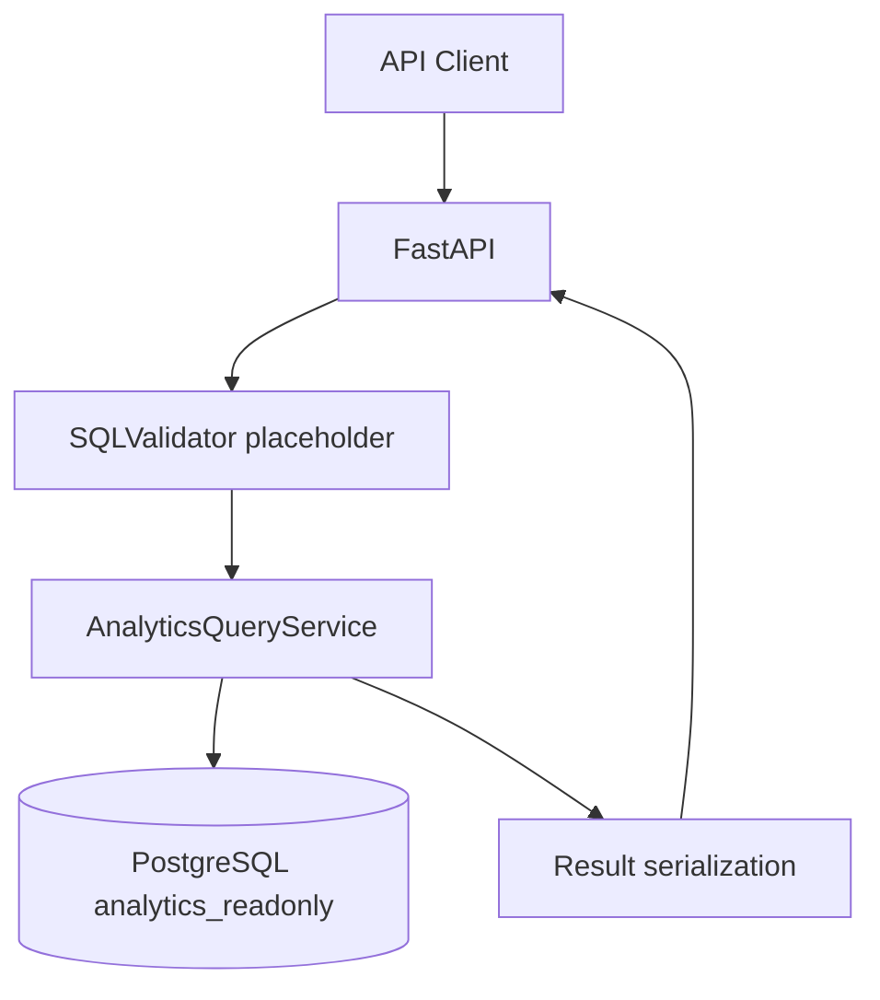

# Architecture

The backend remains a modular monolith. The analytics service uses the separate read-only database URL, validates direct SQL input, executes with configurable limits, and normalizes results before returning JSON. The LLM and SQL generation pipeline will be added in later sprints.
