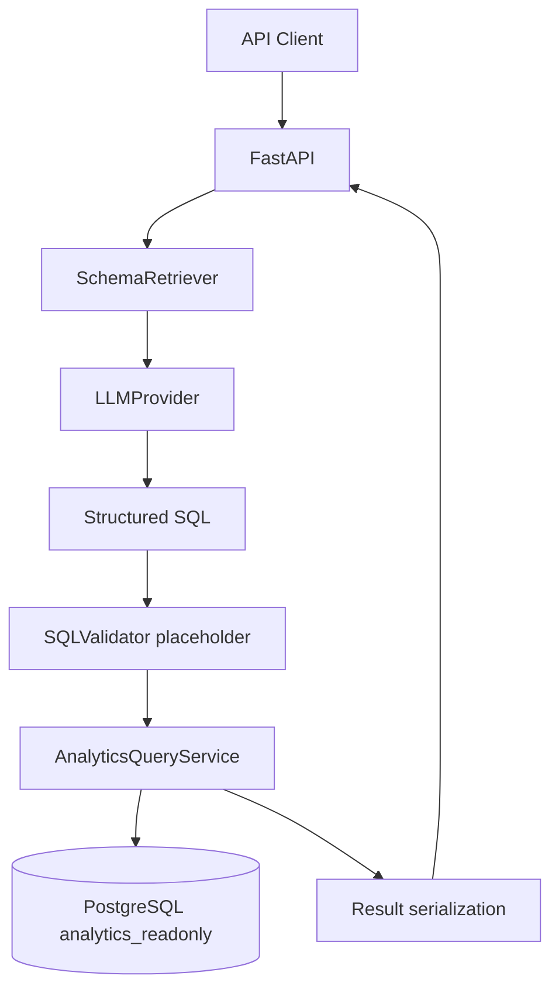

# Architecture

The backend remains a modular monolith. `/generate` retrieves relevant schema and business definitions before calling either the deterministic mock provider or the optional OpenAI provider. `/ask` passes generated SQL into the existing validator and analytics service; generation never executes SQL directly.
