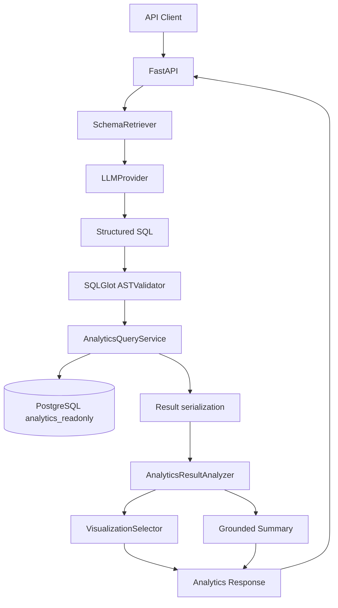

# Architecture

The backend remains a modular monolith. `/generate` retrieves relevant schema and business definitions before calling either the deterministic mock provider or the optional Gemini provider. `/ask` passes generated SQL into the existing validator and analytics service, then analyzes returned rows locally, selects visualization metadata, and creates a grounded summary. Generation never executes SQL directly.
