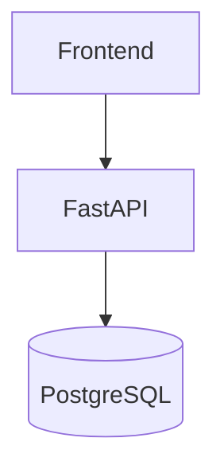

# Architecture

The LLM, SQL generation, and analytics pipeline will be added in later sprints. Sprint 1 keeps the system as a modular monolith with a single backend application and PostgreSQL database.
