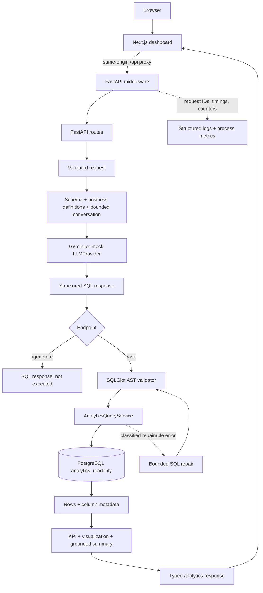

# Architecture

```mermaid
flowchart TD
    Browser[Browser] --> Next[Next.js dashboard]
    Next -->|same-origin /api proxy| Middleware[FastAPI middleware]
    Middleware --> API[FastAPI routes]
    API --> Request[Validated request]
    Request --> Context[Schema + business definitions + bounded conversation]
    Context --> Provider[Gemini or mock LLMProvider]
    Provider --> Parsed[Structured SQL response]
    Parsed --> Generate{Endpoint}
    Generate -->|/generate| SQLResponse[SQL response; not executed]
    Generate -->|/ask| Validator[SQLGlot AST validator]
    Validator --> Executor[AnalyticsQueryService]
    Executor --> DB[(PostgreSQL analytics_readonly)]
    DB --> Results[Rows + column metadata]
    Results --> Intelligence[KPI + visualization + grounded summary]
    Intelligence --> Response[Typed analytics response]
    Response --> Next
    Executor -. classified repairable error .-> Repair[Bounded SQL repair]
    Repair --> Validator
    Middleware -. request IDs, timings, counters .-> Ops[Structured logs + process metrics]
```

The backend remains a modular monolith. `/generate` retrieves relevant schema and business definitions before calling the selected provider, then returns SQL without executing it. `/ask` adds bounded conversation context, validates generated SQL, and executes it through the read-only analytics service. Only classified repairable failures can enter the bounded repair loop; repaired SQL returns through the same validator. Result analysis, chart metadata selection, and summaries happen after execution.

The Next.js app is a presentation layer. Its server-side rewrite proxies `/api/*` to FastAPI by default, so browser requests are same-origin. The UI renders typed response data and does not decide SQL validity, table access, metric definitions, or visualization policy.

FastAPI middleware bounds request bodies, applies configurable process-local rate limits, assigns request IDs, adds security headers, and records request duration. The API also exposes liveness/readiness and a small process-local metrics snapshot. No additional services or query-result cache are introduced; conversation memory, metrics, and rate-limit state are process-local.
