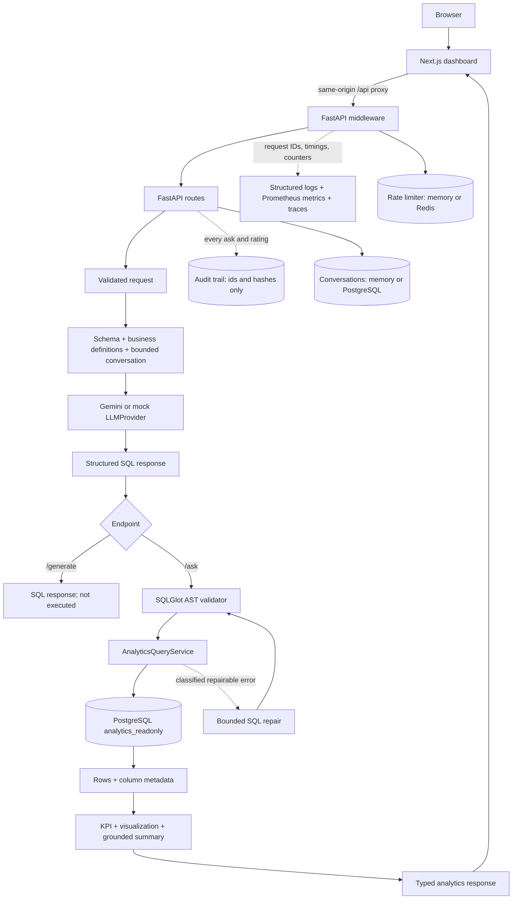

# Architecture

```mermaid
flowchart TD
    Browser[Browser] --> Next[Next.js dashboard]
    Next -->|same-origin /api proxy| Middleware[FastAPI middleware]
    Middleware --> API[FastAPI routes]
    API --> Request[Validated request]
    Request --> Context[Schema + business definitions + bounded conversation]
    Context --> Provider[Gemini or mock LLMProvider]
    Provider --> Parsed[Structured SQL response]
    Parsed --> Generate{Endpoint}
    Generate -->|/generate| SQLResponse[SQL response; not executed]
    Generate -->|/ask| Validator[SQLGlot AST validator]
    Validator --> Executor[AnalyticsQueryService]
    Executor --> DB[(PostgreSQL analytics_readonly)]
    DB --> Results[Rows + column metadata]
    Results --> Intelligence[KPI + visualization + grounded summary]
    Intelligence --> Response[Typed analytics response]
    Response --> Next
    Executor -. classified repairable error .-> Repair[Bounded SQL repair]
    Repair --> Validator
    Middleware -. request IDs, timings, counters .-> Ops[Structured logs + Prometheus metrics + traces]
    API -. every ask and rating .-> Audit[(Audit trail: ids and hashes only)]
    API --> Conversations[(Conversations: memory or PostgreSQL)]
    Middleware --> Limiter[(Rate limiter: memory or Redis)]
```

The backend remains a modular monolith. `/generate` retrieves relevant schema and business definitions before calling the selected provider, then returns SQL without executing it. `/ask` adds bounded conversation context, validates generated SQL, and executes it through the read-only analytics service. Only classified repairable failures can enter the bounded repair loop; repaired SQL returns through the same validator. Result analysis, chart metadata selection, and summaries happen after execution.

The Next.js app is a presentation layer. Its server-side rewrite proxies `/api/*` to FastAPI by default, so browser requests are same-origin. The UI renders typed response data and does not decide SQL validity, table access, metric definitions, or visualization policy.

FastAPI middleware bounds request bodies, assigns request IDs, adds security headers, records request duration, and opens a trace span. Authentication and per-principal rate limiting run as route dependencies, in that order, so limits are keyed on the authenticated principal.

## State and scaling

The backend can be stateless. Its three pieces of state each have a process-local default for a single instance and a shared implementation for several:

| State | Default (one instance) | Shared (many replicas) | Setting |
|---|---|---|---|
| Conversations and turns | in memory, lost on restart | PostgreSQL tables, survive restarts and deploys | `CONVERSATION_STORE` |
| Rate-limit counters | in memory, per replica | Redis sorted sets, one limit for the whole deployment | `RATE_LIMIT_BACKEND` |
| Prompt-to-SQL cache (optional) | in memory | not shared (a miss is only an extra LLM call) | `SQL_CACHE_ENABLED` |

Both durable stores sit behind small interfaces (`ConversationStore`, `RateLimiter`), so the in-memory versions double as test fakes. The operational tables (`conversations`, `conversation_turns`, `audit_log`) live on their own SQLAlchemy base (`app/db/operational.py`), separate from the fleet models, so they can never become part of the analytics allowlist, the prompt schema, or the `analytics` views.

## Request pipeline

1. Authenticate (JWT) and rate limit (per principal and route family).
2. Resolve conversation context (owner-checked) and the full schema; look up the SQL cache for standalone questions.
3. Call the provider on a worker thread, bounded by the request deadline.
4. Validate the SQL (AST, allowlists, enforced `LIMIT`), then execute it in a read-only transaction scoped to the caller's tenant, after an `EXPLAIN` cost pre-flight.
5. On a repairable failure, repair with a sanitized hint and go back to step 4, within the deadline.
6. Analyze the result (KPI, chart, summary), store the exchange, write the audit event, and return the answer with its `request_id`.

Every stage records a labelled metric and, when tracing is on, a span; none of them carries question or SQL text.
