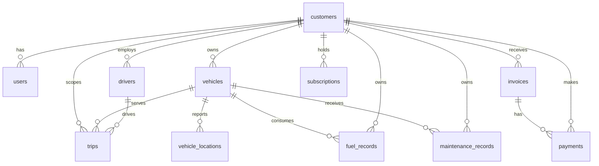

# Database Schema

Sprint 2 uses PostgreSQL as the application database and Alembic as the schema owner. The initial migration creates the fleet-management SaaS dataset plus the internal `seed_runs` idempotency table.

## Entity Relationships

## Tables

- `customers`: tenant identity, company, region, and lifecycle status.
- `users`: tenant operators and analysts.
- `vehicles`: registered fleet assets and their operational state.
- `drivers`: tenant drivers and license validity.
- `trips`: journey facts used for utilization, distance, fuel, and idle-time analysis.
- `vehicle_locations`: vehicle GPS time series.
- `fuel_records`: fuel volume, price, and spend.
- `maintenance_records`: service history and costs.
- `invoices`: customer billing facts.
- `payments`: invoice-linked collections.
- `subscriptions`: plan and recurring revenue facts.

All operational and financial records retain `customer_id` where useful for tenant-scoped analytics. Foreign keys enforce ownership, and checks enforce valid statuses, nonnegative measures, and valid date ordering.

## Indexes

Indexes cover foreign keys, customer and vehicle joins, time-series columns (`start_time`, `recorded_at`, `fuel_date`, `maintenance_date`, `invoice_date`, and `payment_date`), and common status filters. Composite indexes support tenant-plus-time queries without indexing every column.

## Seed Data

`make seed` runs `app.db.seed` with deterministic randomness and creates:

- 100 customers
- 1,000 vehicles
- 500 drivers
- 50,000 trips
- 20,000 vehicle locations
- 20,000 fuel records
- 10,000 maintenance records
- 10,000 invoices
- 20,000 payments
- 100 subscriptions

Dates span 2024 and 2025. Vehicle, driver, trip, invoice, and payment ownership is generated consistently. A `seed_runs` marker makes repeated runs no-ops.

## Database Users

The `app` role owns the schema and is used by migrations and the backend. PostgreSQL initialization creates `analytics_readonly`, grants it database connection and schema usage, and applies `SELECT` to tables created by the `app` role through default privileges. It receives no `INSERT`, `UPDATE`, `DELETE`, `CREATE`, `ALTER`, or `DROP` grants. The separate `ANALYTICS_DATABASE_URL` is reserved for future read-only generated-query execution.

After starting PostgreSQL and applying the migration, run `make verify-permissions` to execute the permission assertions in `database/verify-readonly.sql`.

## Schema Metadata

`app.db.schema_metadata` exposes table names, descriptions, columns, types, and foreign-key relationships for future schema retrieval. Semantic and vector retrieval are intentionally deferred.