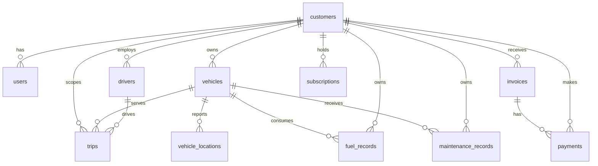

# Database Schema

Sprint 2 uses PostgreSQL as the application database and Alembic as the schema owner. The initial migration creates the fleet-management SaaS dataset plus the internal `seed_runs` idempotency table.

## Entity Relationships

```mermaid
erDiagram
    customers ||--o{ users : has
    customers ||--o{ vehicles : owns
    customers ||--o{ drivers : employs
    customers ||--o{ trips : scopes
    vehicles ||--o{ trips : serves
    drivers ||--o{ trips : drives
    vehicles ||--o{ vehicle_locations : reports
    vehicles ||--o{ fuel_records : consumes
    customers ||--o{ fuel_records : owns
    vehicles ||--o{ maintenance_records : receives
    customers ||--o{ maintenance_records : owns
    customers ||--o{ invoices : receives
    invoices ||--o{ payments : has
    customers ||--o{ payments : makes
    customers ||--o{ subscriptions : holds
```

## Tables

- `customers`: tenant identity, company, region, and lifecycle status.
- `users`: tenant operators and analysts.
- `vehicles`: registered fleet assets and their operational state.
- `drivers`: tenant drivers and license validity.
- `trips`: journey facts used for utilization, distance, fuel, and idle-time analysis.
- `vehicle_locations`: vehicle GPS time series.
- `fuel_records`: fuel volume, price, and spend.
- `maintenance_records`: service history and costs.
- `invoices`: customer billing facts.
- `payments`: invoice-linked collections.
- `subscriptions`: plan and recurring revenue facts.

All operational and financial records retain `customer_id` where useful for tenant-scoped analytics. Foreign keys enforce ownership, and checks enforce valid statuses, nonnegative measures, and valid date ordering.

## Indexes

Indexes cover foreign keys, customer and vehicle joins, time-series columns (`start_time`, `recorded_at`, `fuel_date`, `maintenance_date`, `invoice_date`, and `payment_date`), and common status filters. Composite indexes support tenant-plus-time queries without indexing every column.

## Seed Data

`make seed` runs `app.db.seed` with deterministic randomness and creates:

- 100 customers
- 1,000 vehicles
- 500 drivers
- 50,000 trips
- 20,000 vehicle locations
- 20,000 fuel records
- 10,000 maintenance records
- 10,000 invoices
- 20,000 payments
- 100 subscriptions

Dates span 2024 and 2025. Vehicle, driver, trip, invoice, and payment ownership is generated consistently. A `seed_runs` marker makes repeated runs no-ops.

## Database Users

The `app` role owns the schema and is used by migrations and application database access. PostgreSQL initialization creates `analytics_readonly` with database connection only; it receives **no privileges on the `public` tables and no default privileges**. Migration `b7c2d41f8a10` creates the `analytics` schema: one view per analytics table (omitting `customers.name/email`, `users.name/email`, and `drivers.name/phone/license_number`) that filters rows to the caller's tenant via `analytics.row_visible()`, grants `SELECT` on those views only, and sets the role's `search_path` to `analytics`, so queries keep using plain table names. `vehicle_locations` has no customer column and is scoped through its vehicle. It receives no `INSERT`, `UPDATE`, `DELETE`, `CREATE`, `ALTER`, or `DROP` grants. `AnalyticsQueryService` uses the separate `ANALYTICS_DATABASE_URL` for direct and generated read-only SQL execution. Fresh Compose clusters use distinct owner and analytics passwords; existing clusters need explicit role password rotation.

After starting PostgreSQL and applying the migration, run `make verify-permissions` to execute the permission assertions in `database/verify-readonly.sql`.

## Schema Metadata

`app.db.schema_metadata` exposes table names, descriptions, columns, types, and foreign-key relationships used by the schema retriever and SQL validator. Retrieval is deterministic and keyword-based; semantic embeddings and vector retrieval are future improvements.

## Operational tables

Three tables hold service state rather than fleet data. They are created by migration `c3d91e5a7b20`, declared on `OperationalBase` (not on the fleet `Base`), and are invisible to analytics: they are absent from `ALLOWED_TABLES`, from the prompt schema, and from the `analytics` views, and `analytics_readonly` has no privileges on them (`tests/test_conversation_postgres.py` proves it).

| Table | Contents | Retention |
|---|---|---|
| `conversations` | id, owner (the principal's id), created and updated timestamps | idle longer than `CONVERSATION_TTL_DAYS` (default 30) |
| `conversation_turns` | conversation id, role, content, and for assistant turns the SQL and tables used (never result rows); trimmed to `CONVERSATION_MAX_TURNS` | deleted with the conversation |
| `audit_log` | timestamp, event (`ask` or `feedback`), request id, principal, customer id, conversation id, SQL hash, tables, row count, duration, outcome, error code, rating | `AUDIT_RETENTION_DAYS` (default 365) |

`python -m app.jobs.purge` applies both retention periods. The audit table holds identifiers and a SHA-256 of the SQL only, so it can be retained and reviewed without becoming a second copy of user content.
